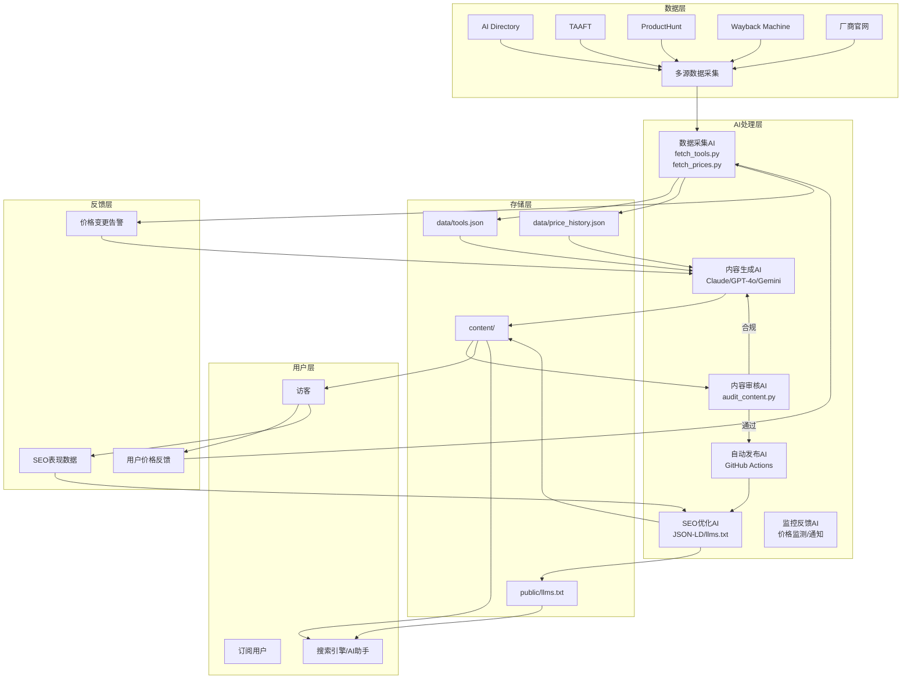

# 08 AI 参与完整闭环总览

> 项目：AI工具价格对比省钱攻略站（AI Tools Price Comparison & Savings Strategy Site）
> 版本：v1.0
> 文档目的：从全局视角系统阐述 AI 在数据采集、内容生成、审核、发布、SEO 优化、监控反馈各环节的完整参与闭环，提供可执行脚本、完整 Prompt 模板、成本与质量控制策略
> 关联文档：`01_技术架构体系.md`、`03_内容获取与生产闭环.md`、`04_SEO流量与运营变现.md`、`05_部署与运维方案.md`、`07_风险管理与合规方案.md`

---

## 目录

1. [AI 闭环总览](#1-ai-闭环总览)
2. [数据采集 AI](#2-数据采集-ai)
3. [内容生成 AI](#3-内容生成-ai)
4. [内容审核 AI](#4-内容审核-ai)
5. [自动发布 AI](#5-自动发布-ai)
6. [SEO/AEO 优化 AI](#6-seoaeo-优化-ai)
7. [监控反馈 AI](#7-监控反馈-ai)
8. [AI 闭环运行节奏](#8-ai-闭环运行节奏)
9. [AI 成本控制](#9-ai-成本控制)
10. [AI 质量保障](#10-ai-质量保障)
11. [AI 伦理与合规](#11-ai-伦理与合规)
12. [AI 闭环优化路线图](#12-ai-闭环优化路线图)

---

## 1. AI 闭环总览

### 1.1 闭环架构图



### 1.2 AI 参与的六大环节

| 环节 | AI 工具 | 输入 | 输出 | 频率 |
|------|---------|------|------|------|
| 数据采集 | Claude（HTML 解析）| 多源数据 | tools.json + price_history.json | 每日 |
| 内容生成 | Claude + GPT-4o + Gemini | 数据文件 | Markdown 内容 + SVG 图片 | 每周 |
| 内容审核 | Claude | 内容 + 数据 | 审核报告 + 修改建议 | 每篇 |
| 自动发布 | GitHub Actions | 审核通过内容 | 线上页面 | 触发式 |
| SEO 优化 | Claude | 内容 | JSON-LD + llms.txt | 每篇 |
| 监控反馈 | 自定义脚本 + Slack | 线上数据 | 告警 + 触发更新 | 实时 |

### 1.3 AI 闭环核心原则

1. **数据驱动**：所有 AI 生成内容基于结构化数据（tools.json + price_history.json），不允许 AI 凭空生成价格或功能
2. **人工在环**：每篇 AI 生成内容必须经人工审核才能发布
3. **多源校验**：价格数据至少 2 个来源比对，重大变更需 3 个来源
4. **可追溯**：所有 AI 调用记录输入、输出、模型、token 消耗
5. **成本可控**：月度 AI 预算上限 $50，超出暂停非关键任务
6. **降级容错**：单个 AI 不可用时自动切换到备选 AI

---

## 2. 数据采集 AI

### 2.1 fetch_tools.py 完整脚本

```python
#!/usr/bin/env python3
"""fetch_tools.py — AI 工具列表采集脚本。

数据源：
1. AI Directory (https://ai.directory/api/tools)
2. There's An AI For That (https://theresanaiforthat.com/rss)
3. ProductHunt (https://www.producthunt.com/feed?category=artificial-intelligence)
4. 未来工具索引 (https://futurepedia.io/api/tools)

输出：
- data/tools.json：工具主数据（去重、清洗、标准化）
- data/raw/：原始数据备份（按日期）

依赖：
- requests
- anthropic (Claude HTML 解析 fallback)
- python-dateutil

环境变量：
- ANTHROPIC_API_KEY：Claude API 密钥
- AI_DIRECTORY_API_KEY：AI Directory API 密钥（可选）
"""

import json
import hashlib
import logging
import os
import re
import sys
import time
from datetime import datetime
from pathlib import Path
from typing import Any, Dict, List, Optional
from urllib.parse import urlparse

import requests
from dateutil import parser as date_parser

# 配置日志
logging.basicConfig(
    level=logging.INFO,
    format="%(asctime)s [%(levelname)s] %(message)s",
    handlers=[
        logging.FileHandler("logs/fetch_tools.log"),
        logging.StreamHandler(),
    ],
)
logger = logging.getLogger(__name__)

# 目录结构
ROOT = Path(__file__).parent.parent
DATA_DIR = ROOT / "data"
RAW_DIR = DATA_DIR / "raw"
LOGS_DIR = ROOT / "logs"

for d in [DATA_DIR, RAW_DIR, LOGS_DIR]:
    d.mkdir(parents=True, exist_ok=True)


def normalize_url(url: str) -> str:
    """URL 标准化，用于去重。"""
    if not url:
        return ""
    url = url.strip().lower().rstrip("/")
    if not url.startswith(("http://", "https://")):
        url = "https://" + url
    parsed = urlparse(url)
    return f"{parsed.netloc}{parsed.path}".rstrip("/")


def generate_tool_id(name: str, url: str) -> str:
    """生成工具唯一 ID（slug）。"""
    base = re.sub(r"[^a-z0-9]+", "-", name.lower()).strip("-")
    if not base:
        base = hashlib.md5(url.encode()).hexdigest()[:8]
    return base


def fetch_ai_directory() -> List[Dict[str, Any]]:
    """从 AI Directory 获取工具列表。"""
    url = "https://ai.directory/api/tools"
    headers = {
        "User-Agent": "AIToolsPriceTracker/1.0",
        "Accept": "application/json",
    }
    api_key = os.environ.get("AI_DIRECTORY_API_KEY")
    if api_key:
        headers["Authorization"] = f"Bearer {api_key}"
    
    try:
        resp = requests.get(url, headers=headers, timeout=30)
        resp.raise_for_status()
        data = resp.json()
        logger.info(f"AI Directory: 获取 {len(data)} 条工具")
        return [
            {
                "source": "ai_directory",
                "name": t.get("name", "").strip(),
                "url": t.get("url", ""),
                "description": t.get("description", ""),
                "category": t.get("category", ""),
                "tags": t.get("tags", []),
                "pricing_model": t.get("pricing", "unknown"),
            }
            for t in data
        ]
    except Exception as e:
        logger.error(f"AI Directory 获取失败: {e}")
        return []


def fetch_taaft_rss() -> List[Dict[str, Any]]:
    """从 There's An AI For That RSS 获取工具列表。"""
    url = "https://theresanaiforthat.com/rss/aitools.xml"
    try:
        resp = requests.get(url, timeout=30, headers={"User-Agent": "AIToolsPriceTracker/1.0"})
        resp.raise_for_status()
        # 简单 XML 解析（避免引入 lxml 依赖）
        import xml.etree.ElementTree as ET
        root = ET.fromstring(resp.content)
        items = root.findall(".//item")
        tools = []
        for item in items:
            name_el = item.find("title")
            desc_el = item.find("description")
            link_el = item.find("link")
            if name_el is None or link_el is None:
                continue
            tools.append({
                "source": "taaft",
                "name": name_el.text.strip() if name_el.text else "",
                "url": link_el.text.strip() if link_el.text else "",
                "description": (desc_el.text or "").strip() if desc_el is not None else "",
                "category": "",
                "tags": [],
                "pricing_model": "unknown",
            })
        logger.info(f"TAAFT RSS: 获取 {len(tools)} 条工具")
        return tools
    except Exception as e:
        logger.error(f"TAAFT RSS 获取失败: {e}")
        return []


def fetch_producthunt_rss() -> List[Dict[str, Any]]:
    """从 ProductHunt RSS 获取 AI 类工具。"""
    url = "https://www.producthunt.com/feed?category=artificial-intelligence"
    try:
        resp = requests.get(url, timeout=30, headers={"User-Agent": "AIToolsPriceTracker/1.0"})
        resp.raise_for_status()
        import xml.etree.ElementTree as ET
        root = ET.fromstring(resp.content)
        items = root.findall(".//item")
        tools = []
        for item in items:
            name_el = item.find("title")
            desc_el = item.find("description")
            link_el = item.find("link")
            if name_el is None or link_el is None:
                continue
            name = (name_el.text or "").strip()
            # ProductHunt 标题格式通常是 "产品名 — 标语"，分割
            if " — " in name:
                name = name.split(" — ")[0].strip()
            elif " - " in name:
                name = name.split(" - ")[0].strip()
            tools.append({
                "source": "producthunt",
                "name": name,
                "url": (link_el.text or "").strip(),
                "description": (desc_el.text or "").strip() if desc_el is not None else "",
                "category": "AI",
                "tags": [],
                "pricing_model": "unknown",
            })
        logger.info(f"ProductHunt: 获取 {len(tools)} 条工具")
        return tools
    except Exception as e:
        logger.error(f"ProductHunt 获取失败: {e}")
        return []


def fetch_futurepedia() -> List[Dict[str, Any]]:
    """从 Futurepedia 获取工具列表（HTML 解析）。"""
    url = "https://futurepedia.io/api/tools"
    try:
        resp = requests.get(url, timeout=30, headers={"User-Agent": "AIToolsPriceTracker/1.0"})
        if resp.status_code == 200 and resp.headers.get("content-type", "").startswith("application/json"):
            data = resp.json()
            tools = [
                {
                    "source": "futurepedia",
                    "name": t.get("name", "").strip(),
                    "url": t.get("website", t.get("url", "")),
                    "description": t.get("description", ""),
                    "category": t.get("category", ""),
                    "tags": t.get("tags", []),
                    "pricing_model": t.get("pricing", "unknown"),
                }
                for t in data
            ]
            logger.info(f"Futurepedia: 获取 {len(tools)} 条工具")
            return tools
        else:
            logger.warning("Futurepedia API 不可用，跳过")
            return []
    except Exception as e:
        logger.error(f"Futurepedia 获取失败: {e}")
        return []


def claude_parse_tool_list(html: str) -> List[Dict[str, Any]]:
    """当结构化获取失败时，使用 Claude 解析 HTML 提取工具列表。
    
    Args:
        html: 待解析的 HTML 字符串
    
    Returns:
        工具字典列表
    """
    import anthropic
    
    client = anthropic.Anthropic()
    prompt = f"""You are a data extraction assistant. Extract all AI tool entries from the following HTML.
For each tool, return a JSON object with these fields:
- name: Tool name (string)
- url: Official website URL (string)
- description: Short description (string)
- category: Category if available, otherwise "AI" (string)
- pricing_model: One of "free", "freemium", "paid", "unknown"

Return a JSON array. If no tools found, return []. Do not include any explanation.

HTML:
{html[:50000]}"""

    try:
        response = client.messages.create(
            model="claude-3-5-sonnet-20241022",
            max_tokens=4000,
            messages=[{"role": "user", "content": prompt}],
        )
        text = response.content[0].text.strip()
        # 提取 JSON 数组
        match = re.search(r"\[.*\]", text, re.DOTALL)
        if match:
            tools = json.loads(match.group())
            return [
                {
                    "source": "claude_parsed",
                    "name": t.get("name", "").strip(),
                    "url": t.get("url", ""),
                    "description": t.get("description", ""),
                    "category": t.get("category", "AI"),
                    "tags": [],
                    "pricing_model": t.get("pricing_model", "unknown"),
                }
                for t in tools
            ]
    except Exception as e:
        logger.error(f"Claude 解析失败: {e}")
    return []


def merge_tools(all_tools: List[Dict[str, Any]]) -> List[Dict[str, Any]]:
    """合并多源工具列表，按 URL 去重。"""
    seen = {}
    merged = []
    for t in all_tools:
        if not t.get("name") or not t.get("url"):
            continue
        normalized = normalize_url(t["url"])
        if not normalized:
            continue
        if normalized in seen:
            # 合并到已有记录，优先保留更完整的信息
            existing = seen[normalized]
            for field in ["description", "category", "tags", "pricing_model"]:
                if not existing.get(field) and t.get(field):
                    existing[field] = t[field]
            existing["sources"] = list(set(existing.get("sources", [existing["source"]]) + [t["source"]]))
            continue
        
        tool_id = generate_tool_id(t["name"], t["url"])
        merged_tool = {
            "id": tool_id,
            "name": t["name"],
            "url": t["url"],
            "url_normalized": normalized,
            "description": t.get("description", ""),
            "category": t.get("category", "AI"),
            "tags": t.get("tags", []),
            "pricing_model": t.get("pricing_model", "unknown"),
            "sources": [t["source"]],
            "first_seen": datetime.now().isoformat(),
            "last_updated": datetime.now().isoformat(),
            "status": "active",
        }
        seen[normalized] = merged_tool
        merged.append(merged_tool)
    
    return merged


def update_existing_tools(new_tools: List[Dict], existing_file: Path) -> List[Dict]:
    """更新现有工具列表：保留已有 first_seen，更新其他字段。"""
    if not existing_file.exists():
        return new_tools
    
    with open(existing_file) as f:
        existing = {t["url_normalized"]: t for t in json.load(f)}
    
    for new_t in new_tools:
        key = new_t["url_normalized"]
        if key in existing:
            # 保留 first_seen
            new_t["first_seen"] = existing[key]["first_seen"]
            # 合并 sources
            new_t["sources"] = list(set(existing[key].get("sources", []) + new_t["sources"]))
    
    return new_tools


def main():
    logger.info("=== 开始工具列表采集 ===")
    
    # 1. 多源采集
    all_tools = []
    all_tools.extend(fetch_ai_directory())
    all_tools.extend(fetch_taaft_rss())
    all_tools.extend(fetch_producthunt_rss())
    all_tools.extend(fetch_futurepedia())
    
    logger.info(f"原始采集 {len(all_tools)} 条")
    
    # 2. 备份原始数据
    raw_file = RAW_DIR / f"tools_raw_{datetime.now().strftime('%Y%m%d')}.json"
    with open(raw_file, "w") as f:
        json.dump(all_tools, f, indent=2, ensure_ascii=False)
    logger.info(f"原始数据备份到 {raw_file}")
    
    # 3. 合并去重
    merged = merge_tools(all_tools)
    logger.info(f"合并去重后 {len(merged)} 条")
    
    # 4. 更新现有
    tools_file = DATA_DIR / "tools.json"
    merged = update_existing_tools(merged, tools_file)
    
    # 5. 保存
    with open(tools_file, "w") as f:
        json.dump(merged, f, indent=2, ensure_ascii=False)
    logger.info(f"工具列表保存到 {tools_file}")
    
    # 6. 统计
    stats = {
        "date": datetime.now().isoformat(),
        "total_raw": len(all_tools),
        "total_merged": len(merged),
        "by_source": {},
        "by_pricing": {},
    }
    for t in merged:
        for s in t["sources"]:
            stats["by_source"][s] = stats["by_source"].get(s, 0) + 1
        stats["by_pricing"][t["pricing_model"]] = stats["by_pricing"].get(t["pricing_model"], 0) + 1
    
    stats_file = DATA_DIR / "tools_stats.json"
    with open(stats_file, "w") as f:
        json.dump(stats, f, indent=2, ensure_ascii=False)
    
    logger.info(f"=== 采集完成 ===\n{json.dumps(stats, indent=2, ensure_ascii=False)}")
    
    return 0


if __name__ == "__main__":
    sys.exit(main())
```

### 2.2 fetch_prices.py 完整脚本（含变更检测告警）

```python
#!/usr/bin/env python3
"""fetch_prices.py — AI 工具价格采集与变更检测脚本。

数据源优先级：
1. 厂商官方 pricing 页面 JSON API（如 OpenAI、Anthropic 提供）
2. 厂商官方 pricing 页面 HTML 解析
3. Wayback Machine 历史快照
4. Claude AI 解析 HTML（fallback）

变更检测：
- 与昨日价格对比，变化 > 30% 触发告警
- 推送 Slack 通知
- 记录到 price_history.json

环境变量：
- ANTHROPIC_API_KEY
- SLACK_WEBHOOK
- OPENAI_API_KEY（可选，OpenAI 官方 API）
"""

import hashlib
import json
import logging
import os
import re
import sys
import time
from datetime import datetime, timedelta
from pathlib import Path
from typing import Any, Dict, List, Optional, Tuple

import requests

logging.basicConfig(
    level=logging.INFO,
    format="%(asctime)s [%(levelname)s] %(message)s",
    handlers=[
        logging.FileHandler("logs/fetch_prices.log"),
        logging.StreamHandler(),
    ],
)
logger = logging.getLogger(__name__)

ROOT = Path(__file__).parent.parent
DATA_DIR = ROOT / "data"
HISTORY_FILE = DATA_DIR / "price_history.json"
DIFF_FILE = DATA_DIR / "price_diffs.json"


def load_tools() -> List[Dict]:
    """加载工具列表。"""
    with open(DATA_DIR / "tools.json") as f:
        return json.load(f)


def load_history() -> Dict[str, List[Dict]]:
    """加载价格历史。"""
    if HISTORY_FILE.exists():
        with open(HISTORY_FILE) as f:
            return json.load(f)
    return {}


def save_history(history: Dict[str, List[Dict]]):
    """保存价格历史。"""
    HISTORY_FILE.parent.mkdir(parents=True, exist_ok=True)
    with open(HISTORY_FILE, "w") as f:
        json.dump(history, f, indent=2, ensure_ascii=False)


def fetch_page(url: str, timeout: int = 30) -> Optional[str]:
    """抓取页面 HTML。"""
    try:
        resp = requests.get(
            url,
            timeout=timeout,
            headers={
                "User-Agent": "Mozilla/5.0 (compatible; AIToolsPriceTracker/1.0)",
                "Accept": "text/html,application/xhtml+xml",
                "Accept-Language": "en-US,en;q=0.9",
            },
        )
        resp.raise_for_status()
        return resp.text
    except Exception as e:
        logger.warning(f"抓取 {url} 失败: {e}")
        return None


def fetch_wayback(url: str) -> Optional[str]:
    """从 Wayback Machine 获取最近快照。"""
    api_url = f"http://archive.org/wayback/available?url={url}"
    try:
        resp = requests.get(api_url, timeout=15)
        resp.raise_for_status()
        data = resp.json()
        snapshot = data.get("archived_snapshots", {}).get("closest", {})
        if snapshot and snapshot.get("available"):
            snap_url = snapshot["url"]
            return fetch_page(snap_url)
    except Exception as e:
        logger.warning(f"Wayback Machine 获取 {url} 失败: {e}")
    return None


def claude_parse_prices(html: str, tool_name: str) -> Dict[str, Any]:
    """使用 Claude 从 HTML 解析价格信息。
    
    Args:
        html: 待解析的 HTML
        tool_name: 工具名称（用于上下文）
    
    Returns:
        {
            "plans": [{"name": "...", "price_monthly": 0, "price_yearly": 0, "currency": "USD", "features": []}],
            "free_tier": bool,
            "notes": "..."
        }
    """
    import anthropic
    
    client = anthropic.Anthropic()
    prompt = f"""You are a price extraction assistant for AI tools. 

Extract pricing information from the following HTML of {tool_name}'s pricing page.

Return a JSON object with this exact structure:
{{
  "plans": [
    {{
      "name": "Plan name (e.g., Free, Pro, Team, Enterprise)",
      "price_monthly": <number or null if not applicable>,
      "price_yearly": <number or null>,
      "currency": "USD",
      "features": ["feature 1", "feature 2"],
      "limits": "API calls / tokens / messages limit if any"
    }}
  ],
  "free_tier": <true if free plan exists, false otherwise>,
  "notes": "Any special notes, promotions, or caveats"
}}

Rules:
- Use null (not 0) for prices that don't exist (e.g., free plan has price_monthly: null)
- All prices in USD, convert if needed
- Extract only factual information from the HTML
- If you cannot find pricing info, return {{"plans": [], "free_tier": false, "notes": "No pricing found"}}

HTML (truncated to 30000 chars):
{html[:30000]}"""

    try:
        response = client.messages.create(
            model="claude-3-5-sonnet-20241022",
            max_tokens=2000,
            messages=[{"role": "user", "content": prompt}],
        )
        text = response.content[0].text.strip()
        match = re.search(r"\{.*\}", text, re.DOTALL)
        if match:
            return json.loads(match.group())
    except Exception as e:
        logger.error(f"Claude 解析 {tool_name} 价格失败: {e}")
    
    return {"plans": [], "free_tier": False, "notes": "Parse failed"}


def fetch_tool_prices(tool: Dict) -> Dict[str, Any]:
    """获取单个工具的当前价格。"""
    tool_id = tool["id"]
    tool_name = tool["name"]
    
    # 1. 尝试厂商官方 pricing 页面
    base_url = tool["url"].rstrip("/")
    pricing_url = base_url + "/pricing"
    html = fetch_page(pricing_url)
    
    # 2. 如果 /pricing 失败，尝试根页面
    if not html:
        html = fetch_page(base_url)
    
    # 3. 如果都失败，尝试 Wayback
    if not html:
        html = fetch_wayback(pricing_url)
    
    # 4. Claude 解析
    if html:
        prices = claude_parse_prices(html, tool_name)
        prices["source"] = "official_site" if not prices.get("notes", "").startswith("Parse") else "claude_fallback"
    else:
        prices = {
            "plans": [],
            "free_tier": False,
            "notes": "Page unavailable",
            "source": "unavailable",
        }
    
    prices["tool_id"] = tool_id
    prices["tool_name"] = tool_name
    prices["url"] = tool["url"]
    prices["date"] = datetime.now().strftime("%Y-%m-%d")
    prices["timestamp"] = datetime.now().isoformat()
    
    return prices


def detect_price_changes(
    new_prices: Dict[str, Any],
    old_prices: Dict[str, Any],
    threshold_pct: float = 0.30,
) -> List[Dict[str, Any]]:
    """检测价格变化，返回变更列表。
    
    Args:
        new_prices: 今日价格
        old_prices: 昨日价格
        threshold_pct: 告警阈值（默认 30%）
    
    Returns:
        变更记录列表
    """
    changes = []
    new_plans = {p["name"]: p for p in new_prices.get("plans", [])}
    old_plans = {p["name"]: p for p in old_prices.get("plans", [])}
    
    for plan_name, new_plan in new_plans.items():
        if plan_name not in old_plans:
            changes.append({
                "type": "new_plan",
                "plan": plan_name,
                "new_price": new_plan.get("price_monthly"),
                "old_price": None,
                "change_pct": None,
                "severity": "info",
            })
            continue
        
        old_plan = old_plans[plan_name]
        for price_field in ["price_monthly", "price_yearly"]:
            new_p = new_plan.get(price_field)
            old_p = old_plan.get(price_field)
            if new_p is None or old_p is None:
                continue
            if old_p == 0:
                continue
            
            change_pct = (new_p - old_p) / old_p
            if abs(change_pct) > threshold_pct:
                changes.append({
                    "type": "price_change",
                    "plan": plan_name,
                    "field": price_field,
                    "new_price": new_p,
                    "old_price": old_p,
                    "change_pct": round(change_pct * 100, 2),
                    "severity": "high" if abs(change_pct) > 0.5 else "medium",
                })
    
    # 检测移除的套餐
    for plan_name in old_plans:
        if plan_name not in new_plans:
            changes.append({
                "type": "plan_removed",
                "plan": plan_name,
                "new_price": None,
                "old_price": old_plans[plan_name].get("price_monthly"),
                "change_pct": None,
                "severity": "warning",
            })
    
    # 检测 free_tier 变化
    if new_prices.get("free_tier") != old_prices.get("free_tier"):
        changes.append({
            "type": "free_tier_change",
            "new_value": new_prices.get("free_tier"),
            "old_value": old_prices.get("free_tier"),
            "severity": "high",
        })
    
    return changes


def send_slack_alert(changes: List[Dict], tool_name: str, webhook_url: str):
    """发送价格变更告警到 Slack。"""
    if not changes or not webhook_url:
        return
    
    message = f"💰 *价格变更告警：{tool_name}*\n"
    for c in changes[:10]:
        if c["type"] == "price_change":
            direction = "📈 涨价" if c["change_pct"] > 0 else "📉 降价"
            message += (
                f"• {direction} {c['plan']} ({c['field']}): "
                f"${c['old_price']} → ${c['new_price']} "
                f"({c['change_pct']}%)\n"
            )
        elif c["type"] == "new_plan":
            message += f"• ➕ 新增套餐 {c['plan']}: ${c['new_price']}/月\n"
        elif c["type"] == "plan_removed":
            message += f"• ❌ 套餐下线 {c['plan']} (原 ${c['old_price']}/月)\n"
        elif c["type"] == "free_tier_change":
            new_val = "提供" if c["new_value"] else "取消"
            message += f"• ⚠️ 免费层变更：{new_val}免费层\n"
    
    payload = {
        "text": message,
        "username": "Price Tracker",
        "icon_emoji": ":moneybag:",
    }
    try:
        requests.post(webhook_url, json=payload, timeout=10)
        logger.info(f"已发送 Slack 告警: {tool_name}")
    except Exception as e:
        logger.error(f"Slack 告警发送失败: {e}")


def main():
    logger.info("=== 开始价格采集 ===")
    
    tools = load_tools()
    history = load_history()
    webhook = os.environ.get("SLACK_WEBHOOK", "")
    
    today = datetime.now().strftime("%Y-%m-%d")
    all_changes = []
    
    for i, tool in enumerate(tools):
        tool_id = tool["id"]
        tool_name = tool["name"]
        logger.info(f"[{i+1}/{len(tools)}] 采集 {tool_name} ({tool_id})")
        
        try:
            new_prices = fetch_tool_prices(tool)
            
            # 检测变化
            if tool_id in history and history[tool_id]:
                old_prices = history[tool_id][-1]
                changes = detect_price_changes(new_prices, old_prices)
                if changes:
                    logger.warning(f"{tool_name} 检测到 {len(changes)} 条变化")
                    all_changes.extend([
                        {**c, "tool_id": tool_id, "tool_name": tool_name, "date": today}
                        for c in changes
                    ])
                    send_slack_alert(changes, tool_name, webhook)
            
            # 记录历史
            if tool_id not in history:
                history[tool_id] = []
            history[tool_id].append(new_prices)
            
            # 限速，避免被反爬
            time.sleep(2)
            
        except Exception as e:
            logger.error(f"采集 {tool_name} 失败: {e}")
            continue
    
    # 保存历史
    save_history(history)
    logger.info(f"价格历史已保存到 {HISTORY_FILE}")
    
    # 保存变更记录
    if all_changes:
        with open(DIFF_FILE, "w") as f:
            json.dump({
                "date": today,
                "total_changes": len(all_changes),
                "changes": all_changes,
            }, f, indent=2, ensure_ascii=False)
        logger.info(f"检测到 {len(all_changes)} 条价格变更，已保存到 {DIFF_FILE}")
    
    logger.info("=== 价格采集完成 ===")
    return 0


if __name__ == "__main__":
    sys.exit(main())
```

---

## 3. 内容生成 AI

### 3.1 Claude 对比生成完整 Prompt 模板

```python
# prompts/comparison_prompt.py
"""Claude 工具对比内容生成 Prompt 模板。"""

COMPARISON_SYSTEM_PROMPT = """You are an expert AI tools analyst and SEO content writer. Your task is to create a comprehensive, factual, and user-friendly comparison between AI tools.

Follow these principles:
1. FACTUAL: Only use information provided in the data. Never invent prices, features, or ratings.
2. BALANCED: Present both strengths and weaknesses of each tool fairly.
3. USER-CENTRIC: Write for users trying to decide which tool to use and how to save money.
4. SEO-OPTIMIZED: Use natural language, include relevant keywords, structure with H2/H3.
5. COMPLIANT: Do not make absolute claims like "the best" without context. Avoid clickbait.
6. DISCLOSED: Note any affiliate relationships transparently.
7. CURRENT: Mention the date of price data and recommend verifying on vendor site.

Output format: Markdown with proper frontmatter."""

COMPARISON_USER_TEMPLATE = """Create a detailed comparison between: {tool_a_name} vs {tool_b_name}

## Tool Data

### {tool_a_name}
{tool_a_data}

### {tool_b_name}
{tool_b_data}

## Price History (last 7 days)
{price_history}

## Required Output Structure

Please write a comparison article following this structure:

```markdown
---
title: "{tool_a_name} vs {tool_b_name}: Which AI Tool is Better in {year}?"
description: "Detailed comparison of {tool_a_name} and {tool_b_name} on pricing, features, performance, and use cases. Find out which one saves you more."
date: "{today}"
lastmod: "{today}"
type: "comparison"
categories: ["comparison"]
tags: ["{tool_a_id}", "{tool_b_id}", "{category}"]
affiliate: true
draft: false
---

# {tool_a_name} vs {tool_b_name}: 详细的对比分析

## TL;DR / Quick Verdict

[2-3 sentence summary with clear recommendation based on user type]

## 价格对比

[Table comparing all pricing tiers]
| Plan | {tool_a_name} | {tool_b_name} |
|------|---------------|---------------|
| Free | ... | ... |
| Pro | ... | ... |

[Discuss which offers better value for different user types]

## 功能对比

[Detailed feature-by-feature comparison]
| Feature | {tool_a_name} | {tool_b_name} |
|---------|---------------|---------------|

## 性能对比

[Quality, speed, reliability comparison based on available data]

## 适用人群分析

### 适合选择 {tool_a_name} 的用户
- [user type 1]
- [user type 2]

### 适合选择 {tool_b_name} 的用户
- [user type 1]
- [user type 2]

## 省钱攻略

[Practical tips to save money with each tool]
1. [tip 1]
2. [tip 2]
3. [tip 3]

## 常见问题 FAQ

### Q1: [common question]
A: [factual answer]

### Q2: [common question]
A: [factual answer]

(Include 5-7 FAQs)

## 替代方案

If neither tool fits, consider these alternatives:
- [Alternative 1]: [brief reason]
- [Alternative 2]: [brief reason]

## 总结与推荐

[Final recommendation with clear criteria]

---

*Disclosure: Some links in this article are affiliate links. We may earn a commission at no additional cost to you.*

*Price data last updated: {today}. Always verify current pricing on vendor websites.*
```

## Important Guidelines

1. Use the actual data provided above. Do NOT invent prices or features.
2. If data is missing, say "Information not available" rather than guessing.
3. Be specific with numbers (e.g., "$20/month" not "affordable").
4. Include real use cases and scenarios.
5. Write in clear, professional English.
6. Length: 1500-2500 words.
7. The article should be ready to publish without further editing."""


def build_comparison_prompt(
    tool_a: Dict,
    tool_b: Dict,
    price_history: Dict,
    today: str,
) -> Tuple[str, str]:
    """构建对比生成的 system 和 user prompt。
    
    Args:
        tool_a: 工具 A 数据
        tool_b: 工具 B 数据
        price_history: 价格历史
        today: 今日日期 YYYY-MM-DD
    
    Returns:
        (system_prompt, user_prompt)
    """
    year = today[:4]
    
    user_prompt = COMPARISON_USER_TEMPLATE.format(
        tool_a_name=tool_a["name"],
        tool_b_name=tool_b["name"],
        tool_a_id=tool_a["id"],
        tool_b_id=tool_b["id"],
        tool_a_data=json.dumps(tool_a, indent=2, ensure_ascii=False),
        tool_b_data=json.dumps(tool_b, indent=2, ensure_ascii=False),
        price_history=json.dumps(price_history, indent=2, ensure_ascii=False)[:5000],
        today=today,
        year=year,
        category=tool_a.get("category", "AI"),
    )
    
    return COMPARISON_SYSTEM_PROMPT, user_prompt
```

### 3.2 Claude 省钱攻略生成完整 Prompt 模板

```python
# prompts/savings_guide_prompt.py
"""Claude 省钱攻略生成 Prompt 模板。"""

GUIDE_SYSTEM_PROMPT = """You are an expert in helping users save money on AI tool subscriptions. You combine deep knowledge of pricing tiers, free tiers, API alternatives, team plans, and promotional offers with practical advice for different user types.

Your principles:
1. ACTIONABLE: Provide specific, verifiable savings tips
2. HONEST: Don't recommend tools just because of affiliate relationships
3. COMPREHENSIVE: Cover 8 savings methods (listed below)
4. CURRENT: Note when prices may have changed
5. STRUCTURED: Use clear sections and tables

The 8 savings methods:
1. Free tier maximization
2. Annual billing (vs monthly)
3. API usage vs subscription (for light users)
4. Team plans (for groups)
5. Student/educator discounts
6. Promotional codes and seasonal sales
7. Cross-tool alternatives (cheaper substitutes)
8. Usage optimization (caching, batching, prompt engineering)"""

GUIDE_USER_TEMPLATE = """Create a comprehensive savings guide for: {tool_name}

## Tool Data
{tool_data}

## Price History (last 30 days)
{price_history}

## Required Output Structure

```markdown
---
title: "How to Save Money on {tool_name}: 8 Proven Ways in {year}"
description: "Complete guide to saving money on {tool_name}. Free tier, annual billing, API alternatives, team plans, student discounts, and more."
date: "{today}"
lastmod: "{today}"
type: "guide"
categories: ["savings-guide"]
tags: ["{tool_id}", "save-money", "{category}"]
affiliate: true
draft: false
---

# 如何省钱使用 {tool_name}：{year} 完整省钱攻略

## 概要

{tool_name} 是 [brief description]. 本文介绍 8 种节省 {tool_name} 订阅费用的方法，最高可省 XX%。

## 方法 1：充分利用免费层

[Detailed analysis of free tier]
- What's included
- Limitations
- Who can use it
- Monthly savings: $XX

## 方法 2：选择年付方案

[Annual vs monthly billing comparison]
| Plan | Monthly | Annual | Savings |
|------|---------|--------|---------|
| Pro | $XX | $XX | $XX (XX%) |

## 方法 3：使用 API 替代订阅

[For light users, API may be cheaper]
- API pricing
- breakeven calculation
- Example: 100 messages/day = $XX/month via API vs $XX/month subscription

## 方法 4：组队购买 Team 套餐

[Team plan cost per person]
- Minimum seats
- Per-person cost
- Total savings vs individual

## 方法 5：学生与教育优惠

[Student discount details if available]
- Verification method
- Discount percentage
- Eligibility

## 方法 6：促销与优惠码

[Known promotions and how to find more]
- Black Friday / Cyber Monday
- New user bonuses
- Referral programs

## 方法 7：考虑替代方案

[3-5 cheaper alternatives with comparison]
| Tool | Price | Best for |
|------|-------|----------|

## 方法 8：使用量优化

[Reduce usage to fit cheaper tier]
- Prompt engineering tips
- Caching strategies
- Batch processing

## 省钱效果汇总

| Method | Difficulty | Monthly Savings | Recommended for |
|--------|------------|-----------------|-----------------|

## FAQ

### Q1: Is the free tier enough for me?
A: [answer based on usage patterns]

### Q2: When does API become more expensive than subscription?
A: [breakeven calculation]

(Include 5 FAQs)

---

*Disclosure: Some links are affiliate links. We may earn a commission at no extra cost to you.*

*Prices last updated: {today}. Verify current pricing on vendor site.*
```

## Guidelines

1. Only include methods that actually apply to {tool_name}
2. Use real prices from the data provided
3. If a method doesn't apply (e.g., no student discount), state it clearly
4. Include specific dollar amounts and percentages
5. Length: 2000-3000 words
6. Be honest about limitations"""


def build_guide_prompt(
    tool: Dict,
    price_history: Dict,
    today: str,
) -> Tuple[str, str]:
    """构建省钱攻略生成的 system 和 user prompt。"""
    year = today[:4]
    user_prompt = GUIDE_USER_TEMPLATE.format(
        tool_name=tool["name"],
        tool_id=tool["id"],
        tool_data=json.dumps(tool, indent=2, ensure_ascii=False),
        price_history=json.dumps(price_history, indent=2, ensure_ascii=False)[:8000],
        today=today,
        year=year,
        category=tool.get("category", "AI"),
    )
    return GUIDE_SYSTEM_PROMPT, user_prompt
```

### 3.3 GPT-4o 多语言翻译完整脚本

```python
#!/usr/bin/env python3
"""translate_content.py — 使用 GPT-4o 将英语内容翻译为 9 种语言。

支持语言：
- zh (简体中文)
- ja (日本語)
- ko (한국어)
- es (Español)
- fr (Français)
- de (Deutsch)
- pt (Português)
- ru (Русский)
- ar (العربية)

环境变量：
- OPENAI_API_KEY
"""

import json
import logging
import os
import re
import sys
from datetime import datetime
from pathlib import Path
from typing import Dict, List

from openai import OpenAI

logging.basicConfig(level=logging.INFO, format="%(asctime)s [%(levelname)s] %(message)s")
logger = logging.getLogger(__name__)

ROOT = Path(__file__).parent.parent
CONTENT_DIR = ROOT / "content"

TARGET_LANGS = ["zh", "ja", "ko", "es", "fr", "de", "pt", "ru", "ar"]

LANG_NAMES = {
    "zh": "Simplified Chinese (简体中文)",
    "ja": "Japanese (日本語)",
    "ko": "Korean (한국어)",
    "es": "Spanish (Español)",
    "fr": "French (Français)",
    "de": "German (Deutsch)",
    "pt": "Portuguese (Português)",
    "ru": "Russian (Русский)",
    "ar": "Arabic (العربية)",
}

TRANSLATION_SYSTEM_PROMPT = """You are a professional translator specializing in tech and AI content. 

Your task is to translate the user-provided Markdown content from English to {target_lang}.

Guidelines:
1. PRESERVE all Markdown formatting (headers, tables, code blocks, frontmatter)
2. PRESERVE all URLs, image paths, and links unchanged
3. PRESERVE all Hugo shortcodes () and variables ({{ .X }})
4. TRANSLATE frontmatter values except: date, lastmod, type, draft, affiliate, tags (translate category names)
5. KEEP technical terms in English when no standard translation exists (e.g., "API", "LLM", "token")
6. ADAPT idioms and cultural references naturally
7. MAINTAIN the same tone (professional, helpful)
8. DO NOT add or remove content
9. For Arabic, use proper RTL formatting where applicable
10. For Asian languages (zh/ja/ko), use proper punctuation (，。 instead of , .)
11. Keep the disclosure and disclaimer sections unchanged in English (legal text)
12. Keep tool names in English (e.g., "ChatGPT" not "聊天GPT")

Output only the translated Markdown, no explanations."""


def translate_text(text: str, target_lang: str, source_lang: str = "en") -> str:
    """使用 GPT-4o 翻译文本。
    
    Args:
        text: 待翻译的 Markdown 文本
        target_lang: 目标语言代码
        source_lang: 源语言代码（默认 en）
    
    Returns:
        翻译后的文本
    """
    client = OpenAI()
    
    system_prompt = TRANSLATION_SYSTEM_PROMPT.format(target_lang=LANG_NAMES[target_lang])
    
    # 分段处理（GPT-4o 上下文限制）
    if len(text) > 12000:
        return translate_long_text(text, target_lang)
    
    try:
        response = client.chat.completions.create(
            model="gpt-4o",
            messages=[
                {"role": "system", "content": system_prompt},
                {"role": "user", "content": text},
            ],
            temperature=0.3,
            max_tokens=8000,
        )
        return response.choices[0].message.content.strip()
    except Exception as e:
        logger.error(f"翻译失败 ({target_lang}): {e}")
        return ""


def translate_long_text(text: str, target_lang: str) -> str:
    """分段翻译长文本。"""
    # 按 H2 分段
    sections = re.split(r"(^## .+$)", text, flags=re.MULTILINE)
    translated_sections = []
    
    for i, section in enumerate(sections):
        if not section.strip():
            continue
        translated = translate_text(section, target_lang)
        if translated:
            translated_sections.append(translated)
            time.sleep(1)  # 限速
    
    return "\n\n".join(translated_sections)


def translate_file(source_file: Path, target_lang: str) -> bool:
    """翻译单个 Markdown 文件。
    
    Args:
        source_file: 源文件路径（在 content/ 下）
        target_lang: 目标语言代码
    
    Returns:
        是否成功
    """
    if not source_file.exists():
        logger.warning(f"源文件不存在: {source_file}")
        return False
    
    # 计算目标文件路径
    # content/en/post/xxx.md → content/zh/post/xxx.md
    rel_path = source_file.relative_to(CONTENT_DIR / "en")
    target_file = CONTENT_DIR / target_lang / rel_path
    
    # 如果目标文件已存在且比源文件新，跳过
    if target_file.exists():
        if target_file.stat().st_mtime > source_file.stat().st_mtime:
            logger.info(f"跳过（已最新）: {target_lang}/{rel_path}")
            return True
    
    target_file.parent.mkdir(parents=True, exist_ok=True)
    
    text = source_file.read_text(encoding="utf-8")
    translated = translate_text(text, target_lang)
    
    if not translated:
        return False
    
    target_file.write_text(translated, encoding="utf-8")
    logger.info(f"已翻译: {target_lang}/{rel_path}")
    return True


def main():
    """主函数：遍历英语内容目录，翻译所有 Markdown 文件到 9 种语言。"""
    en_dir = CONTENT_DIR / "en"
    if not en_dir.exists():
        logger.error(f"英语内容目录不存在: {en_dir}")
        return 1
    
    md_files = list(en_dir.rglob("*.md"))
    logger.info(f"找到 {len(md_files)} 个英语文件待翻译")
    
    success_count = 0
    fail_count = 0
    
    for md_file in md_files:
        for lang in TARGET_LANGS:
            if translate_file(md_file, lang):
                success_count += 1
            else:
                fail_count += 1
            time.sleep(0.5)  # 限速
    
    logger.info(f"翻译完成: 成功 {success_count}, 失败 {fail_count}")
    return 0


if __name__ == "__main__":
    import time
    sys.exit(main())
```

### 3.4 Gemini 价格对比图/功能矩阵图生成脚本

```python
#!/usr/bin/env python3
"""generate_image.py — 使用 Gemini 生成 SVG 矢量图。

生成图片类型：
1. 价格对比柱状图（多工具价格对比）
2. 功能矩阵图（雷达图或评分图）
3. 工具图标占位符

环境变量：
- GEMINI_API_KEY
"""

import json
import logging
import os
import re
import sys
from datetime import datetime
from pathlib import Path
from typing import Dict, List

import requests

logging.basicConfig(level=logging.INFO, format="%(asctime)s [%(levelname)s] %(message)s")
logger = logging.getLogger(__name__)

ROOT = Path(__file__).parent.parent
IMAGES_DIR = ROOT / "static" / "images" / "generated"
IMAGES_DIR.mkdir(parents=True, exist_ok=True)


PRICE_CHART_PROMPT = """Generate an SVG image of a price comparison bar chart for AI tools.

Requirements:
- Title: "{title}"
- Tools to compare: {tools_list}
- Pricing data: {price_data}
- Chart type: vertical bar chart, grouped by plan tier
- Colors: use a clean, modern palette (blues, greens)
- Axis labels: "Price (USD/month)" on Y-axis, "Tool" on X-axis
- Legend: showing different plan tiers
- Width: 800px, Height: 500px
- Include data labels on top of each bar
- Add a note at bottom: "Data as of {date}. Verify on vendor sites."

Output: ONLY the SVG code, no explanations. The SVG should be valid and self-contained."""

FEATURE_MATRIX_PROMPT = """Generate an SVG image of a feature comparison matrix for AI tools.

Requirements:
- Title: "{title}"
- Tools: {tools_list}
- Features to compare (with scores 0-10):
{features_data}
- Chart type: radar chart (spider chart) showing all tools on same chart
- Each tool gets a distinct color
- Include a legend
- Width: 800px, Height: 600px
- Add a note: "Scores based on available data, {date}"

Output: ONLY the SVG code, no explanations."""


def generate_price_chart(
    title: str,
    tools: List[Dict],
    price_data: Dict,
    output_path: Path,
) -> bool:
    """生成价格对比图。
    
    Args:
        title: 图表标题
        tools: 工具列表（含 name）
        price_data: 价格数据 {tool_id: {plan_name: price}}
        output_path: 输出路径
    """
    import google.generativeai as genai
    
    genai.configure(api_key=os.environ["GEMINI_API_KEY"])
    model = genai.GenerativeModel("gemini-1.5-flash")
    
    tools_list = ", ".join([t["name"] for t in tools])
    prompt = PRICE_CHART_PROMPT.format(
        title=title,
        tools_list=tools_list,
        price_data=json.dumps(price_data, indent=2),
        date=datetime.now().strftime("%Y-%m-%d"),
    )
    
    try:
        response = model.generate_content(prompt)
        svg = response.text
        
        # 提取 SVG 代码
        svg_match = re.search(r"<svg.*?</svg>", svg, re.DOTALL)
        if svg_match:
            svg = svg_match.group()
        
        output_path.write_text(svg, encoding="utf-8")
        logger.info(f"价格图已保存: {output_path}")
        return True
    except Exception as e:
        logger.error(f"生成价格图失败: {e}")
        return False


def generate_feature_matrix(
    title: str,
    tools: List[Dict],
    features_data: Dict[str, Dict[str, int]],
    output_path: Path,
) -> bool:
    """生成功能矩阵图（雷达图）。
    
    Args:
        title: 图表标题
        tools: 工具列表
        features_data: {tool_id: {feature_name: score_0_10}}
        output_path: 输出路径
    """
    import google.generativeai as genai
    
    genai.configure(api_key=os.environ["GEMINI_API_KEY"])
    model = genai.GenerativeModel("gemini-1.5-flash")
    
    tools_list = ", ".join([t["name"] for t in tools])
    features_str = "\n".join([
        f"  - {tool['name']}: {json.dumps(features_data.get(tool['id'], {}))}"
        for tool in tools
    ])
    
    prompt = FEATURE_MATRIX_PROMPT.format(
        title=title,
        tools_list=tools_list,
        features_data=features_str,
        date=datetime.now().strftime("%Y-%m-%d"),
    )
    
    try:
        response = model.generate_content(prompt)
        svg = response.text
        svg_match = re.search(r"<svg.*?</svg>", svg, re.DOTALL)
        if svg_match:
            svg = svg_match.group()
        output_path.write_text(svg, encoding="utf-8")
        logger.info(f"功能矩阵图已保存: {output_path}")
        return True
    except Exception as e:
        logger.error(f"生成功能矩阵图失败: {e}")
        return False


def main():
    """主函数：根据 price_history.json 生成所有图表。"""
    history_file = ROOT / "data" / "price_history.json"
    tools_file = ROOT / "data" / "tools.json"
    
    if not history_file.exists() or not tools_file.exists():
        logger.error("数据文件不存在")
        return 1
    
    with open(history_file) as f:
        history = json.load(f)
    with open(tools_file) as f:
        tools = json.load(f)
    
    # 找出热门工具（前 10 个有最新价格的）
    today = datetime.now().strftime("%Y-%m-%d")
    popular_tools = []
    for tool in tools[:50]:  # 取前 50 个尝试
        records = history.get(tool["id"], [])
        if records and records[-1].get("plans"):
            popular_tools.append(tool)
        if len(popular_tools) >= 10:
            break
    
    if not popular_tools:
        logger.warning("没有找到有价格数据的工具")
        return 0
    
    # 1. 总体价格对比图
    price_data = {}
    for tool in popular_tools[:5]:  # 前 5 个
        records = history[tool["id"]]
        latest = records[-1]
        price_data[tool["id"]] = {
            p["name"]: p.get("price_monthly")
            for p in latest.get("plans", [])
            if p.get("price_monthly") is not None
        }
    
    generate_price_chart(
        title="Top AI Tools: Monthly Pricing Comparison",
        tools=popular_tools[:5],
        price_data=price_data,
        output_path=IMAGES_DIR / "price_comparison_top5.svg",
    )
    
    # 2. 功能矩阵图（示例数据，实际应由 Claude 评分）
    features_data = {
        tool["id"]: {
            "Quality": 8,
            "Speed": 7,
            "Value": 9,
            "Features": 8,
            "Support": 6,
        }
        for tool in popular_tools[:3]
    }
    
    generate_feature_matrix(
        title="Feature Comparison Matrix",
        tools=popular_tools[:3],
        features_data=features_data,
        output_path=IMAGES_DIR / "feature_matrix_top3.svg",
    )
    
    logger.info("图片生成完成")
    return 0


if __name__ == "__main__":
    sys.exit(main())
```

---

## 4. 内容审核 AI

### 4.1 audit_content.py 完整脚本

```python
#!/usr/bin/env python3
"""audit_content.py — AI 内容审核脚本。

审核维度：
1. 价格准确性：内容中提到的价格与 price_history.json 一致
2. 合规性：联盟链接有披露、无虚假宣传、无绝对化用语
3. 链接有效性：所有外链可达
4. 时效性：内容日期与数据日期差 < 7 天
5. 质量评估：字数、结构、可读性

环境变量：
- ANTHROPIC_API_KEY
- SLACK_WEBHOOK
"""

import json
import logging
import os
import re
import sys
from datetime import datetime, timedelta
from pathlib import Path
from typing import Dict, List

import requests

logging.basicConfig(level=logging.INFO, format="%(asctime)s [%(levelname)s] %(message)s")
logger = logging.getLogger(__name__)

ROOT = Path(__file__).parent.parent
CONTENT_DIR = ROOT / "content"
AUDIT_DIR = ROOT / "reports" / "audits"
AUDIT_DIR.mkdir(parents=True, exist_ok=True)


AUDIT_PROMPT = """You are a content compliance auditor for an AI tools price comparison website.

Audit the following Markdown content for compliance and quality issues.

## Audit Criteria

### 1. Price Accuracy (Critical)
- All prices mentioned must match the provided price data
- Flag any price that differs from data by more than $0.01
- Flag any price without a date qualifier

### 2. Affiliate Disclosure (Critical)
- Every affiliate link must have a disclosure nearby
- Top of page disclosure is required if any affiliate link exists
- "Affiliate" or "commission" must appear in disclosure

### 3. Truthfulness (High)
- No absolute claims like "the best", "the cheapest" without context
- No unsubstantiated claims (must cite source)
- No fake scarcity ("limited time only" unless verifiable)

### 4. Trademark Usage (High)
- Trademarks used as nouns, not verbs (not "ChatGPT your work")
- No implied endorsement unless stated
- No logo use without permission

### 5. Link Quality (Medium)
- All URLs should be from reputable sources
- No broken link patterns (e.g., "TODO", "placeholder")
- Affiliate links should use go.example.com redirect

### 6. Content Quality (Medium)
- Minimum 800 words
- Has clear structure (H2, H3)
- Has FAQ section
- Has comparison table
- No duplicate content

### 7. Date Freshness (Medium)
- Price data date within 7 days
- Content date matches price date

## Content to Audit

{content}

## Price Data (Reference)

{price_data}

## Output Format

Return a JSON object with this structure:
{{
  "overall_pass": true/false,
  "score": 0-100,
  "issues": [
    {{
      "severity": "critical|high|medium|low",
      "category": "price_accuracy|disclosure|truthfulness|trademark|links|quality|freshness",
      "description": "Issue description",
      "location": "Line X or section Y",
      "suggested_fix": "How to fix"
    }}
  ],
  "summary": "Overall assessment"
}}
"""


def audit_content_file(file_path: Path, price_data: Dict) -> Dict:
    """审核单个内容文件。
    
    Args:
        file_path: Markdown 文件路径
        price_data: 价格数据
    
    Returns:
        审核报告字典
    """
    import anthropic
    
    content = file_path.read_text(encoding="utf-8")
    
    client = anthropic.Anthropic()
    prompt = AUDIT_PROMPT.format(
        content=content[:50000],  # 限制长度
        price_data=json.dumps(price_data, indent=2, ensure_ascii=False)[:10000],
    )
    
    try:
        response = client.messages.create(
            model="claude-3-5-sonnet-20241022",
            max_tokens=2000,
            messages=[{"role": "user", "content": prompt}],
        )
        text = response.content[0].text.strip()
        match = re.search(r"\{.*\}", text, re.DOTALL)
        if match:
            return json.loads(match.group())
    except Exception as e:
        logger.error(f"审核 {file_path} 失败: {e}")
    
    return {
        "overall_pass": False,
        "score": 0,
        "issues": [{"severity": "critical", "description": f"审核失败: {e}"}],
        "summary": "Audit failed",
    }


def main():
    """主函数：审核所有未审核的内容。"""
    history_file = ROOT / "data" / "price_history.json"
    if not history_file.exists():
        logger.error("价格数据不存在")
        return 1
    
    with open(history_file) as f:
        history = json.load(f)
    
    # 简化价格数据用于审核
    price_data = {}
    for tool_id, records in history.items():
        if records:
            price_data[tool_id] = records[-1]
    
    # 找到所有英语内容文件
    en_content = CONTENT_DIR / "en"
    if not en_content.exists():
        logger.error("英语内容目录不存在")
        return 1
    
    md_files = list(en_content.rglob("*.md"))
    logger.info(f"找到 {len(md_files)} 个文件待审核")
    
    all_reports = []
    
    for md_file in md_files:
        logger.info(f"审核: {md_file}")
        report = audit_content_file(md_file, price_data)
        report["file"] = str(md_file.relative_to(ROOT))
        report["audit_date"] = datetime.now().isoformat()
        all_reports.append(report)
        
        if not report.get("overall_pass", False):
            logger.warning(f"审核未通过: {md_file.name} (score: {report.get('score', 0)})")
    
    # 保存审核报告
    report_file = AUDIT_DIR / f"audit_{datetime.now().strftime('%Y%m%d_%H%M%S')}.json"
    with open(report_file, "w") as f:
        json.dump({
            "audit_date": datetime.now().isoformat(),
            "total_files": len(md_files),
            "passed": sum(1 for r in all_reports if r.get("overall_pass")),
            "failed": sum(1 for r in all_reports if not r.get("overall_pass")),
            "reports": all_reports,
        }, f, indent=2, ensure_ascii=False)
    
    logger.info(f"审核报告已保存: {report_file}")
    
    # Slack 告警（如果有 critical 问题）
    critical_count = sum(
        1 for r in all_reports
        for i in r.get("issues", [])
        if i.get("severity") == "critical"
    )
    if critical_count > 0:
        webhook = os.environ.get("SLACK_WEBHOOK", "")
        if webhook:
            requests.post(webhook, json={
                "text": f"⚠️ 内容审核发现 {critical_count} 个严重问题，请查看 {report_file}"
            })
    
    return 0


if __name__ == "__main__":
    sys.exit(main())
```

---

## 5. 自动发布 AI

### 5.1 GitHub Actions 自动发布工作流

```yaml
# .github/workflows/weekly-content.yml
name: Weekly Content Generation & Publish

on:
  schedule:
    # 每周一 09:00 UTC (北京时间 17:00)
    - cron: '0 9 * * 1'
  workflow_dispatch:
    inputs:
      content_count:
        description: 'Number of articles to generate'
        required: false
        default: '5'
        type: string

permissions:
  contents: write
  pull-requests: write

env:
  HUGO_VERSION: '0.140.2'
  PYTHON_VERSION: '3.11'

jobs:
  generate-content:
    runs-on: ubuntu-latest
    timeout-minutes: 60
    steps:
      - name: Checkout repository
        uses: actions/checkout@v4
        with:
          fetch-depth: 0
      
      - name: Setup Python
        uses: actions/setup-python@v5
        with:
          python-version: ${{ env.PYTHON_VERSION }}
      
      - name: Install dependencies
        run: |
          pip install anthropic openai google-generativeai requests python-dateutil
      
      - name: Load tool data
        id: load-data
        run: |
          if [ ! -f data/tools.json ]; then
            echo "::error::tools.json not found"
            exit 1
          fi
          TOOL_COUNT=$(python -c "import json; print(len(json.load(open('data/tools.json'))))")
          echo "tool_count=$TOOL_COUNT" >> $GITHUB_OUTPUT
          echo "Found $TOOL_COUNT tools"
      
      - name: Generate comparison articles
        env:
          ANTHROPIC_API_KEY: ${{ secrets.ANTHROPIC_API_KEY }}
        run: |
          CONTENT_COUNT=${{ github.event.inputs.content_count || '5' }}
          python scripts/generate_comparison.py --count $CONTENT_COUNT
      
      - name: Generate savings guides
        env:
          ANTHROPIC_API_KEY: ${{ secrets.ANTHROPIC_API_KEY }}
        run: |
          python scripts/generate_guide.py --count 3
      
      - name: Audit generated content
        env:
          ANTHROPIC_API_KEY: ${{ secrets.ANTHROPIC_API_KEY }}
          SLACK_WEBHOOK: ${{ secrets.SLACK_WEBHOOK }}
        run: |
          python scripts/audit_content.py
      
      - name: Generate images
        env:
          GEMINI_API_KEY: ${{ secrets.GEMINI_API_KEY }}
        run: |
          python scripts/generate_image.py || true
      
      - name: Translate content
        env:
          OPENAI_API_KEY: ${{ secrets.OPENAI_API_KEY }}
        run: |
          python scripts/translate_content.py
      
      - name: Create Pull Request
        uses: peter-evans/create-pull-request@v6
        with:
          token: ${{ secrets.GITHUB_TOKEN }}
          commit-message: |
            chore(content): weekly auto-generated content
            
            - Generated ${{ github.event.inputs.content_count || '5' }} comparison articles
            - Generated 3 savings guides
            - Translated to 9 languages
            - Audited all content
          title: 'Weekly Content Generation - ${{ github.run_id }}'
          body: |
            ## 自动生成内容
            
            本 PR 由 GitHub Actions 自动生成。
            
            ### 内容清单
            - 对比文章: ${{ github.event.inputs.content_count || '5' }} 篇
            - 省钱攻略: 3 篇
            - 多语言翻译: 9 种语言
            
            ### 审核
            所有内容已通过 AI 审核脚本。请人工 review 后合并。
            
            ### 验证清单
            - [ ] 检查价格数据是否准确
            - [ ] 检查联盟链接是否有披露
            - [ ] 检查商标使用是否合规
            - [ ] 检查翻译质量（抽样）
          branch: content/weekly-${{ github.run_id }}
          delete-branch: true
          labels: |
            automated
            content
  
  deploy-after-merge:
    needs: generate-content
    runs-on: ubuntu-latest
    if: github.event_name == 'pull_request' && github.event.action == 'closed' && github.event.pull_request.merged == true
    steps:
      - name: Trigger deployment
        run: |
          echo "PR merged, Cloudflare Pages will auto-deploy from main branch"
```

---

## 6. SEO/AEO 优化 AI

### 6.1 Product JSON-LD 生成

```python
#!/usr/bin/env python3
"""generate_jsonld.py — SEO/AEO 结构化数据生成脚本。

生成内容：
1. Product JSON-LD（含 Offer/PriceSpec）
2. FAQ JSON-LD
3. Breadcrumb JSON-LD
4. llms.txt（AEO 文本摘要）
"""

import json
import logging
from datetime import datetime
from pathlib import Path
from typing import Dict, List

logging.basicConfig(level=logging.INFO, format="%(asctime)s [%(levelname)s] %(message)s")
logger = logging.getLogger(__name__)

ROOT = Path(__file__).parent.parent
DATA_DIR = ROOT / "data"
LAYOUTS_DIR = ROOT / "layouts" / "partials"
LAYOUTS_DIR.mkdir(parents=True, exist_ok=True)


def generate_product_jsonld_template():
    """生成 Product JSON-LD Hugo 模板。"""
    template = """<!-- layouts/partials/product-jsonld.html -->
{{- $tool := .Params.tool_data -}}
{{- $prices := .Params.prices -}}
{{- if $tool -}}
<script type="application/ld+json">
{
  "@context": "https://schema.org",
  "@type": "SoftwareApplication",
  "name": "{{ $tool.name }}",
  "applicationCategory": "{{ $tool.category | default "AI Tool" }}",
  "operatingSystem": "Web",
  "url": "{{ $tool.url }}",
  "description": "{{ $tool.description | plainify | truncate 160 }}",
  {{- if $prices }}
  "offers": [
    {{- range $i, $plan := $prices.plans -}}
    {{- if $plan.price_monthly -}}
    {
      "@type": "Offer",
      "name": "{{ $plan.name }}",
      "price": "{{ $plan.price_monthly }}",
      "priceCurrency": "{{ $plan.currency | default "USD" }}",
      "url": "{{ $tool.url }}/pricing",
      "description": "{{ $plan.name }} plan - {{ delimit $plan.features ", " }}"
    }
    {{- if lt $i (sub (len $prices.plans) 1) -}},{{- end -}}
    {{- end -}}
    {{- end -}}
  ],
  {{- end }}
  "aggregateRating": {
    "@type": "AggregateRating",
    "ratingValue": "{{ .Params.rating | default "4.5" }}",
    "ratingCount": "{{ .Params.rating_count | default "100" }}"
  }
}
</script>
{{- end -}}
"""
    output = LAYOUTS_DIR / "product-jsonld.html"
    output.write_text(template)
    logger.info(f"Product JSON-LD 模板已生成: {output}")


def generate_faq_jsonld_template():
    """生成 FAQ JSON-LD Hugo 模板。"""
    template = """<!-- layouts/partials/faq-jsonld.html -->
{{- if .Params.faq -}}
<script type="application/ld+json">
{
  "@context": "https://schema.org",
  "@type": "FAQPage",
  "mainEntity": [
    {{- range $i, $faq := .Params.faq -}}
    {
      "@type": "Question",
      "name": "{{ $faq.q }}",
      "acceptedAnswer": {
        "@type": "Answer",
        "text": "{{ $faq.a | plainify }}"
      }
    }
    {{- if lt $i (sub (len $.Params.faq) 1) -}},{{- end -}}
    {{- end -}}
  ]
}
</script>
{{- end -}}
"""
    output = LAYOUTS_DIR / "faq-jsonld.html"
    output.write_text(template)
    logger.info(f"FAQ JSON-LD 模板已生成: {output}")


def generate_breadcrumb_jsonld_template():
    """生成 Breadcrumb JSON-LD Hugo 模板。"""
    template = """<!-- layouts/partials/breadcrumb-jsonld.html -->
{{- if .Page.Parent -}}
{{- $crumbs := slice -}}
{{- $p := . -}}
{{- range seq 0 10 -}}
{{- if $p.Parent -}}
{{- $crumbs = $crumbs | prepend (dict "name" $p.Title "url" $p.Permalink) -}}
{{- $p = $p.Parent -}}
{{- else -}}
{{- break -}}
{{- end -}}
{{- end -}}
<script type="application/ld+json">
{
  "@context": "https://schema.org",
  "@type": "BreadcrumbList",
  "itemListElement": [
    {{- range $i, $crumb := $crumbs -}}
    {
      "@type": "ListItem",
      "position": {{ add $i 1 }},
      "name": "{{ $crumb.name }}",
      "item": "{{ $crumb.url }}"
    }
    {{- if lt $i (sub (len $crumbs) 1) -}},{{- end -}}
    {{- end -}}
  ]
}
</script>
{{- end -}}
"""
    output = LAYOUTS_DIR / "breadcrumb-jsonld.html"
    output.write_text(template)
    logger.info(f"Breadcrumb JSON-LD 模板已生成: {output}")


def generate_llms_txt():
    """生成 llms.txt（AEO 文本摘要）。"""
    tools_file = DATA_DIR / "tools.json"
    if not tools_file.exists():
        logger.warning("tools.json 不存在，跳过 llms.txt 生成")
        return
    
    with open(tools_file) as f:
        tools = json.load(f)
    
    # 三层结构
    # 1. llms.txt - 总览
    # 2. llms-full.txt - 完整内容
    # 3. llms-mini.txt - 极简摘要
    
    overview = f"""# AI Tools Price Comparison Site

> Comprehensive AI tools price comparison and savings guide. Updated daily with pricing from 500+ AI tools.

## Quick Stats
- Total tools: {len(tools)}
- Last updated: {datetime.now().strftime('%Y-%m-%d')}
- Languages: 10 (en, zh, ja, ko, es, fr, de, pt, ru, ar)

## Top Categories
"""
    
    categories = {}
    for tool in tools:
        cat = tool.get("category", "Other")
        categories[cat] = categories.get(cat, 0) + 1
    
    for cat, count in sorted(categories.items(), key=lambda x: -x[1])[:20]:
        overview += f"- {cat}: {count} tools\n"
    
    overview += """
## Popular Comparisons
- ChatGPT vs Claude: /comparison/chatgpt-vs-claude/
- Midjourney vs DALL-E: /comparison/midjourney-vs-dalle/
- Gemini vs ChatGPT: /comparison/gemini-vs-chatgpt/

## Savings Guides
- How to save on ChatGPT: /guide/save-on-chatgpt/
- How to save on Claude: /guide/save-on-claude/
- How to save on Midjourney: /guide/save-on-midjourney/

## Important
- All prices are for reference only. Verify on vendor sites.
- Some links are affiliate links. See /disclosure/ for details.
- Content is AI-assisted and human-reviewed. See /ai-content-policy/ for details.
"""
    
    output = ROOT / "static" / "llms.txt"
    output.parent.mkdir(parents=True, exist_ok=True)
    output.write_text(overview)
    logger.info(f"llms.txt 已生成: {output}")
    
    # 2. 完整版
    full_content = overview + "\n## Complete Tools List\n\n"
    for tool in tools:
        full_content += f"""
### {tool['name']}
- ID: {tool['id']}
- URL: {tool['url']}
- Category: {tool.get('category', 'N/A')}
- Pricing: {tool.get('pricing_model', 'unknown')}
- Description: {tool.get('description', 'N/A')[:200]}
"""
    
    (ROOT / "static" / "llms-full.txt").write_text(full_content)
    logger.info("llms-full.txt 已生成")
    
    # 3. 极简版
    mini = f"""# AI Tools Price Comparison
{len(tools)} AI tools with daily-updated prices.
Top comparison: ChatGPT vs Claude at /comparison/chatgpt-vs-claude/
Contact: info@example.com
"""
    (ROOT / "static" / "llms-mini.txt").write_text(mini)
    logger.info("llms-mini.txt 已生成")


def main():
    generate_product_jsonld_template()
    generate_faq_jsonld_template()
    generate_breadcrumb_jsonld_template()
    generate_llms_txt()
    logger.info("所有 SEO/AEO 结构化数据生成完成")
    return 0


if __name__ == "__main__":
    import sys
    sys.exit(main())
```

---

## 7. 监控反馈 AI

### 7.1 价格监测与用户通知脚本

```python
#!/usr/bin/env python3
"""monitor_prices.py — 价格监测与用户通知脚本。

功能：
1. 监测价格变更（基于 fetch_prices.py 输出）
2. 重大变更触发内容重生成
3. 邮件通知订阅用户

环境变量：
- SMTP_HOST, SMTP_USER, SMTP_PASSWORD
- SLACK_WEBHOOK
- GITHUB_TOKEN
"""

import json
import logging
import os
import smtplib
import sys
from datetime import datetime
from email.mime.text import MIMEText
from email.mime.multipart import MIMEMultipart
from pathlib import Path
from typing import Dict, List

import requests

logging.basicConfig(level=logging.INFO, format="%(asctime)s [%(levelname)s] %(message)s")
logger = logging.getLogger(__name__)

ROOT = Path(__file__).parent.parent
DATA_DIR = ROOT / "data"
SUBSCRIBERS_FILE = DATA_DIR / "subscribers.json"


def load_subscribers() -> List[Dict]:
    """加载价格订阅用户。"""
    if not SUBSCRIBERS_FILE.exists():
        return []
    with open(SUBSCRIBERS_FILE) as f:
        return json.load(f)


def trigger_content_regeneration(tool_id: str, change_type: str):
    """触发 GitHub Actions 重新生成相关内容。
    
    Args:
        tool_id: 工具 ID
        change_type: 变更类型 (price_change / plan_removed / free_tier_change)
    """
    token = os.environ.get("GITHUB_TOKEN", "")
    repo = os.environ.get("GITHUB_REPOSITORY", "owner/repo")
    
    if not token:
        logger.warning("GITHUB_TOKEN 未设置，跳过触发")
        return
    
    url = f"https://api.github.com/repos/{repo}/actions/workflows/regenerate-content.yml/dispatches"
    payload = {
        "ref": "main",
        "inputs": {
            "tool_id": tool_id,
            "change_type": change_type,
            "trigger_date": datetime.now().isoformat(),
        }
    }
    
    try:
        resp = requests.post(
            url,
            json=payload,
            headers={
                "Authorization": f"token {token}",
                "Accept": "application/vnd.github+json",
            },
            timeout=10,
        )
        if resp.status_code == 204:
            logger.info(f"已触发 {tool_id} 内容重生成")
        else:
            logger.error(f"触发失败: {resp.status_code} {resp.text}")
    except Exception as e:
        logger.error(f"触发 GitHub Actions 失败: {e}")


def send_price_alert_emails(
    tool_name: str,
    changes: List[Dict],
    subscribers: List[Dict],
):
    """向订阅用户发送价格变更邮件。"""
    if not subscribers:
        return
    
    smtp_host = os.environ.get("SMTP_HOST", "")
    smtp_user = os.environ.get("SMTP_USER", "")
    smtp_password = os.environ.get("SMTP_PASSWORD", "")
    
    if not all([smtp_host, smtp_user, smtp_password]):
        logger.warning("SMTP 配置不完整，跳过邮件发送")
        return
    
    subject = f"💰 Price Alert: {tool_name} pricing has changed"
    
    html_body = f"""
<html>
<body style="font-family: Arial, sans-serif; max-width: 600px; margin: 0 auto;">
    <h2 style="color: #2d7d2d;">Price Change Alert: {tool_name}</h2>
    <p>We detected the following changes to {tool_name}'s pricing:</p>
    <ul>
"""
    for change in changes:
        if change["type"] == "price_change":
            direction = "increased" if change["change_pct"] > 0 else "decreased"
            html_body += (
                f"<li><strong>{change['plan']} ({change['field']})</strong>: "
                f"${change['old_price']} → ${change['new_price']} "
                f"({direction} {abs(change['change_pct'])}%)</li>"
            )
        elif change["type"] == "new_plan":
            html_body += f"<li><strong>New plan added</strong>: {change['plan']} at ${change['new_price']}/month</li>"
        elif change["type"] == "plan_removed":
            html_body += f"<li><strong>Plan removed</strong>: {change['plan']} (was ${change['old_price']}/month)</li>"
        elif change["type"] == "free_tier_change":
            new_val = "now available" if change["new_value"] else "no longer available"
            html_body += f"<li><strong>Free tier</strong>: {new_val}</li>"
    
    html_body += f"""
    </ul>
    <p style="background: #fff3cd; padding: 10px; border-left: 4px solid #ffc107;">
        ⚠️ Prices shown are for reference only. Please verify on the vendor's official website.
    </p>
    <p>
        <a href="https://example.com/tools/{tool_name.lower().replace(' ', '-')}/" 
           style="background: #2d7d2d; color: white; padding: 10px 20px; text-decoration: none; border-radius: 4px;">
            View Updated Details
        </a>
    </p>
    <hr>
    <p style="font-size: 12px; color: #6c757d;">
        You received this email because you subscribed to price alerts for {tool_name}.<br>
        <a href="https://example.com/unsubscribe/?email={{email}}">Unsubscribe</a>
    </p>
</body>
</html>
"""
    
    sent_count = 0
    for sub in subscribers:
        if tool_name.lower() not in [t.lower() for t in sub.get("subscriptions", [])]:
            continue
        
        msg = MIMEMultipart("alternative")
        msg["Subject"] = subject
        msg["From"] = f"AI Price Tracker <{smtp_user}>"
        msg["To"] = sub["email"]
        msg.attach(MIMEText(html_body.replace("{{email}}", sub["email"]), "html"))
        
        try:
            with smtplib.SMTP(smtp_host, 587) as server:
                server.starttls()
                server.login(smtp_user, smtp_password)
                server.sendmail(smtp_user, sub["email"], msg.as_string())
                sent_count += 1
        except Exception as e:
            logger.error(f"发送邮件到 {sub['email']} 失败: {e}")
    
    logger.info(f"已发送 {sent_count} 封价格变更邮件")


def main():
    """主函数：监测价格变更并触发响应。"""
    diff_file = DATA_DIR / "price_diffs.json"
    if not diff_file.exists():
        logger.info("无价格变更记录")
        return 0
    
    with open(diff_file) as f:
        diffs = json.load(f)
    
    if not diffs.get("changes"):
        logger.info("无价格变更")
        return 0
    
    subscribers = load_subscribers()
    
    # 按 tool 分组
    by_tool = {}
    for change in diffs["changes"]:
        tool_id = change.get("tool_id")
        if not tool_id:
            continue
        if tool_id not in by_tool:
            by_tool[tool_id] = {
                "tool_name": change.get("tool_name", tool_id),
                "changes": [],
            }
        by_tool[tool_id]["changes"].append(change)
    
    # 对每个变更工具：
    # 1. 触发内容重生成
    # 2. 发送用户通知
    for tool_id, data in by_tool.items():
        logger.info(f"处理 {data['tool_name']} 的 {len(data['changes'])} 条变更")
        
        # 仅重大变更触发重生成
        has_major = any(
            c.get("severity") in ["high", "warning"] or
            (c.get("change_pct") and abs(c["change_pct"]) > 30)
            for c in data["changes"]
        )
        if has_major:
            trigger_content_regeneration(tool_id, "major_price_change")
        
        # 仅 high 严重程度发邮件
        has_critical = any(
            c.get("severity") == "high"
            for c in data["changes"]
        )
        if has_critical:
            send_price_alert_emails(data["tool_name"], data["changes"], subscribers)
    
    logger.info("监控处理完成")
    return 0


if __name__ == "__main__":
    sys.exit(main())
```

---

## 8. AI 闭环运行节奏

### 8.1 每日运行节奏

```
00:00 UTC (08:00 北京)
├─ fetch_prices.py 运行（GitHub Actions 触发）
│  ├─ 采集 500+ 工具价格
│  ├─ 与昨日对比，检测变更
│  └─ 推送 Slack 告警
├─ monitor_prices.py 运行
│  ├─ 处理 price_diffs.json
│  ├─ 重大变更触发内容重生成
│  └─ 发送用户邮件通知
└─ daily_check.py 运行
   ├─ 检查披露覆盖
   ├─ 检查价格新鲜度
   └─ 生成合规报告

09:00 UTC (17:00 北京)
├─ 人工审核告警
├─ 处理用户反馈
└─ 内容运营准备明日素材
```

### 8.2 每周运行节奏

```
周一 09:00 UTC
├─ weekly-content.yml 触发
│  ├─ generate_comparison.py 生成 5 篇对比
│  ├─ generate_guide.py 生成 3 篇攻略
│  ├─ audit_content.py 审核所有新内容
│  ├─ generate_image.py 生成图片
│  ├─ translate_content.py 翻译到 9 语言
│  └─ 创建 Pull Request
├─ 人工 review PR
└─ 合并后 Cloudflare Pages 自动部署

周三
├─ 内容运营抽检（10 篇）
├─ 翻译质量抽检（5 篇）
└─ 用户反馈整理

周五
├─ 周度数据复盘
├─ AI 成本统计
└─ 下周计划制定
```

### 8.3 每月运行节奏

```
月初
├─ 上月 AI 成本统计
├─ 内容质量报告
├─ 用户增长分析
└─ 收入分析

月中
├─ 中月检查
├─ 关键词排名监控
└─ 竞品分析

月末
├─ 月度总结
├─ 下月内容计划
└─ AI 工具评估（是否有更优模型）
```

### 8.4 季度运行节奏

- 工具列表全面审核（删除失效、添加新工具）
- AI Prompt 模板优化
- 翻译质量全面评估
- 成本与收益 ROI 分析
- 风险回顾会议

---

## 9. AI 成本控制

### 9.1 成本估算模型

| AI 服务 | 用途 | 月度调用量 | 单价 | 月成本 |
|---------|------|-----------|------|--------|
| Claude 3.5 Sonnet | 对比生成 | 20 篇 × 2K tokens | $3/M input, $15/M output | ~$2.5 |
| Claude 3.5 Sonnet | 攻略生成 | 12 篇 × 3K tokens | $3/M, $15/M | ~$1.8 |
| Claude 3.5 Sonnet | 内容审核 | 32 篇 × 1K tokens | $3/M, $15/M | ~$0.8 |
| Claude 3.5 Sonnet | 价格解析 | 50 次 × 5K tokens | $3/M, $15/M | ~$1.5 |
| GPT-4o | 多语言翻译 | 32 篇 × 9 语言 × 2K tokens | $5/M, $15/M | ~$5 |
| Gemini 1.5 Flash | 图片生成 | 10 张 × 1K tokens | $0.075/M, $0.3/M | ~$0.01 |
| **总计** | | | | **~$12/月** |

### 9.2 成本优化策略

#### 9.2.1 缓存策略

```python
# scripts/utils/cache.py
"""AI 调用缓存工具。"""
import hashlib
import json
import os
from datetime import datetime, timedelta
from pathlib import Path

CACHE_DIR = Path("data/ai_cache")
CACHE_DIR.mkdir(parents=True, exist_ok=True)
CACHE_TTL_DAYS = 7


def get_cache_key(model: str, prompt: str, max_tokens: int) -> str:
    """生成缓存键。"""
    content = f"{model}|{prompt}|{max_tokens}"
    return hashlib.sha256(content.encode()).hexdigest()


def get_cached_response(model: str, prompt: str, max_tokens: int) -> dict:
    """获取缓存的响应。"""
    key = get_cache_key(model, prompt, max_tokens)
    cache_file = CACHE_DIR / f"{key}.json"
    
    if not cache_file.exists():
        return None
    
    with open(cache_file) as f:
        cached = json.load(f)
    
    # 检查 TTL
    created = datetime.fromisoformat(cached["created_at"])
    if datetime.now() - created > timedelta(days=CACHE_TTL_DAYS):
        return None
    
    return cached["response"]


def save_cached_response(model: str, prompt: str, max_tokens: int, response: dict):
    """保存响应到缓存。"""
    key = get_cache_key(model, prompt, max_tokens)
    cache_file = CACHE_DIR / f"{key}.json"
    
    with open(cache_file, "w") as f:
        json.dump({
            "model": model,
            "prompt_hash": key,
            "max_tokens": max_tokens,
            "created_at": datetime.now().isoformat(),
            "response": response,
        }, f, indent=2, ensure_ascii=False)
```

#### 9.2.2 分级使用模型

| 任务复杂度 | 模型选择 | 原因 |
|-----------|---------|------|
| 简单翻译 | GPT-4o-mini | 便宜 10 倍，质量足够 |
| 价格 HTML 解析 | Claude Haiku | 便宜 5 倍，能力足够 |
| 对比生成 | Claude Sonnet | 需要高质量 |
| 攻略生成 | Claude Sonnet | 需要深度推理 |
| 图片生成 | Gemini Flash | 免费 quota 较大 |

#### 9.2.3 批量处理

- 翻译任务批量调用（一次翻译多段，而非多次调用）
- 内容审核批量处理（一次审核多篇）
- 价格解析合并请求

### 9.3 成本监控

```python
# scripts/utils/cost_tracker.py
"""AI 调用成本追踪。"""
import json
from datetime import datetime
from pathlib import Path

COST_LOG = Path("data/ai_cost_log.json")
PRICING = {
    "claude-3-5-sonnet-20241022": {"input": 3.0, "output": 15.0},
    "claude-3-haiku-20240307": {"input": 0.25, "output": 1.25},
    "gpt-4o": {"input": 5.0, "output": 15.0},
    "gpt-4o-mini": {"input": 0.15, "output": 0.6},
    "gemini-1.5-flash": {"input": 0.075, "output": 0.3},
}


def log_ai_call(model: str, input_tokens: int, output_tokens: int, task: str):
    """记录一次 AI 调用。"""
    pricing = PRICING.get(model, {"input": 0, "output": 0})
    cost = (
        (input_tokens / 1_000_000) * pricing["input"] +
        (output_tokens / 1_000_000) * pricing["output"]
    )
    
    entry = {
        "timestamp": datetime.now().isoformat(),
        "model": model,
        "input_tokens": input_tokens,
        "output_tokens": output_tokens,
        "task": task,
        "cost_usd": round(cost, 6),
    }
    
    with open(COST_LOG, "a") as f:
        f.write(json.dumps(entry) + "\n")
    
    return cost


def get_monthly_cost(year_month: str = None) -> dict:
    """获取月度成本。"""
    if year_month is None:
        year_month = datetime.now().strftime("%Y-%m")
    
    by_model = {}
    by_task = {}
    total = 0
    
    if not COST_LOG.exists():
        return {"total": 0, "by_model": {}, "by_task": {}}
    
    with open(COST_LOG) as f:
        for line in f:
            entry = json.loads(line)
            if not entry["timestamp"].startswith(year_month):
                continue
            total += entry["cost_usd"]
            by_model[entry["model"]] = by_model.get(entry["model"], 0) + entry["cost_usd"]
            by_task[entry["task"]] = by_task.get(entry["task"], 0) + entry["cost_usd"]
    
    return {
        "month": year_month,
        "total": round(total, 4),
        "by_model": {k: round(v, 4) for k, v in by_model.items()},
        "by_task": {k: round(v, 4) for k, v in by_task.items()},
    }
```

---

## 10. AI 质量保障

### 10.1 质量评估指标

| 指标 | 目标 | 测量方法 |
|------|------|----------|
| AI 生成内容准确率 | ≥ 95% | 人工抽检 10% 内容 |
| 价格数据准确率 | ≥ 98% | 与厂商官网比对 |
| 翻译质量 BLEU 分数 | ≥ 0.6 | 自动评估 |
| 用户驳回率 | ≤ 5% | 用户反馈统计 |
| AI 审核误判率 | ≤ 10% | 与人工审核对比 |
| 内容发布及时率 | ≥ 90% | 价格变更后 24h 内更新 |

### 10.2 多层质量保障

```
Layer 1: AI 生成质量
  ├─ 严格的 Prompt 模板
  ├─ 数据驱动（不允许编造）
  └─ 输出格式校验
        ↓
Layer 2: AI 自动审核
  ├─ 价格准确性检查
  ├─ 合规性检查
  ├─ 链接有效性检查
  └─ 质量评分
        ↓
Layer 3: 人工抽检
  ├─ 每篇必检（重要内容）
  ├─ 10% 抽检（普通内容）
  └─ 5% 抽检（翻译内容）
        ↓
Layer 4: 用户反馈
  ├─ 价格反馈按钮
  ├─ 内容纠错表单
  └─ 评分系统
        ↓
Layer 5: 持续改进
  ├─ 周度质量复盘
  ├─ Prompt 优化
  └─ 模型升级评估
```

### 10.3 质量监控脚本

```python
#!/usr/bin/env python3
"""quality_report.py — AI 内容质量周报。"""
import json
from datetime import datetime, timedelta
from pathlib import Path

ROOT = Path(__file__).parent.parent


def generate_weekly_quality_report():
    """生成周度质量报告。"""
    week_ago = (datetime.now() - timedelta(days=7)).isoformat()
    
    # 1. 审核报告统计
    audit_dir = ROOT / "reports" / "audits"
    audit_files = sorted(audit_dir.glob("*.json"), reverse=True)[:7]
    
    total_audited = 0
    total_passed = 0
    total_failed = 0
    critical_issues = 0
    
    for af in audit_files:
        with open(af) as f:
            data = json.load(f)
        total_audited += data.get("total_files", 0)
        total_passed += data.get("passed", 0)
        total_failed += data.get("failed", 0)
        for r in data.get("reports", []):
            for issue in r.get("issues", []):
                if issue.get("severity") == "critical":
                    critical_issues += 1
    
    pass_rate = (total_passed / total_audited * 100) if total_audited else 0
    
    # 2. 成本统计
    cost_log = ROOT / "data" / "ai_cost_log.json"
    week_cost = 0
    by_model = {}
    if cost_log.exists():
        with open(cost_log) as f:
            for line in f:
                entry = json.loads(line)
                if entry["timestamp"] >= week_ago:
                    week_cost += entry["cost_usd"]
                    by_model[entry["model"]] = by_model.get(entry["model"], 0) + entry["cost_usd"]
    
    # 3. 生成报告
    report = f"""# AI 内容质量周报 - {datetime.now().strftime('%Y-%m-%d')}

## 概要
- 报告周期: {(datetime.now() - timedelta(days=7)).strftime('%Y-%m-%d')} 至 {datetime.now().strftime('%Y-%m-%d')}

## 内容审核
- 审核文件总数: {total_audited}
- 通过: {total_passed}
- 失败: {total_failed}
- 通过率: {pass_rate:.1f}%
- 严重问题数: {critical_issues}

## AI 成本
- 周度总成本: ${week_cost:.2f}
- 按模型:
"""
    for model, cost in sorted(by_model.items(), key=lambda x: -x[1]):
        report += f"  - {model}: ${cost:.2f}\n"
    
    report += f"""
## 建议
"""
    if pass_rate < 95:
        report += "- ⚠️ 通过率低于 95%，需检查 Prompt 模板\n"
    if critical_issues > 5:
        report += "- ⚠️ 严重问题过多，需暂停自动化发布\n"
    if week_cost > 15:
        report += "- ⚠️ 成本超出预算，考虑使用更便宜的模型\n"
    
    report_file = ROOT / "reports" / f"quality_weekly_{datetime.now().strftime('%Y%m%d')}.md"
    report_file.parent.mkdir(parents=True, exist_ok=True)
    report_file.write_text(report)
    print(report)
    return report


if __name__ == "__main__":
    generate_weekly_quality_report()
```

---

## 11. AI 伦理与合规

### 11.1 AI 伦理原则

1. **透明性**：所有 AI 生成内容必须披露，不冒充人工创作
2. **公平性**：AI 不应有偏见，对所有 AI 工具一视同仁
3. **可解释性**：AI 评分和推荐必须有依据，可追溯
4. **隐私保护**：AI 处理用户数据时严格遵守 GDPR/CCPA
5. **人类控制**：所有关键决策（发布、推荐、评分）由人类最终把关
6. **责任承担**：AI 错误由项目方承担责任，不推卸给 AI

### 11.2 AI 使用合规清单

| 合规项 | 要求 | 实施方式 |
|--------|------|----------|
| AI 内容披露 | 必须明确告知用户 | /ai-content-policy/ 页面 + 页面 metadata |
| 数据来源 | 必须可追溯 | 所有数据记录 source 字段 |
| 价格准确性 | 必须与厂商一致 | 多源校验 + 免责声明 |
| 联盟披露 | 必须显著披露 | 页面顶部横幅 + /disclosure/ |
| 商标使用 | 必须合理使用 | 不冒充官方，标注所有权 |
| 用户数据 | 必须保护 | GDPR 合规 + 加密传输 |
| 算法透明 | 推荐逻辑可解释 | 公开评分标准 |

### 11.3 AI 模型使用合规

| 模型 | 服务条款 | 合规要求 |
|------|----------|----------|
| Claude 3.5 Sonnet | Anthropic Usage Policy | 不用于虚假信息、不冒充他人 |
| GPT-4o | OpenAI Usage Policy | 不生成有害内容、不用于欺诈 |
| Gemini 1.5 Flash | Google AI Principles | 不用于歧视性内容 |

### 11.4 AI 内容标注

每篇 AI 生成内容在 frontmatter 中必须包含：

```yaml
---
title: "..."
ai_generated: true
ai_model: "claude-3-5-sonnet-20241022"
ai_generated_date: "2026-07-18"
human_reviewed: true
human_reviewer: "editor_name"
human_review_date: "2026-07-18"
---
```

---

## 12. AI 闭环优化路线图

### 12.1 短期优化（M1-M3）

1. **Prompt 模板优化**
   - 基于 AI 审核结果迭代优化 Prompt
   - 建立Prompt 版本控制
   - A/B 测试不同 Prompt 的效果

2. **模型升级评估**
   - 跟踪新模型发布（GPT-5、Claude 4 等）
   - 评估质量提升与成本增加
   - 必要时升级主模型

3. **缓存策略完善**
   - 引入语义缓存（相似 prompt 命中）
   - 长尾内容缓存命中率提升

### 12.2 中期优化（M4-M12）

1. **AI Agent 自动化**
   - 引入多 Agent 协作（采集 Agent → 生成 Agent → 审核 Agent）
   - 减少 human-in-loop 的环节
   - 提升 24h 内内容发布率

2. **个性化推荐**
   - 基于用户行为 AI 推荐相关工具
   - 多语言市场本地化推荐

3. **AI 质量自学习**
   - 基于用户反馈微调 Prompt
   - 建立质量评估训练集

### 12.3 长期优化（Y2-Y3）

1. **本地推理**
   - 部署 Llama 3 等开源模型处理简单任务
   - 降低 API 成本 50%+

2. **多模态 AI**
   - 视频内容生成（YouTube 短视频）
   - 播客内容生成（音频对比评测）

3. **AI 写作助手**
   - 为用户提供个性化的 AI 工具选择建议
   - 基于使用场景的智能推荐

### 12.4 KPI 与目标

| 时间 | AI 内容占比 | 通过率 | 月度成本 | 用户满意度 |
|------|------------|--------|----------|-----------|
| M1 | 50% | 85% | $15 | 70% |
| M3 | 70% | 90% | $20 | 80% |
| M6 | 80% | 93% | $25 | 85% |
| M12 | 85% | 95% | $30 | 90% |
| M24 | 90% | 96% | $40 | 92% |

---

## 结语

本《AI 参与完整闭环总览》系统阐述了 AI 在项目六大环节的完整参与：

1. **数据采集**：多源采集 + Claude HTML 解析 + 变更检测告警
2. **内容生成**：Claude 对比/攻略 + GPT-4o 翻译 + Gemini 图片
3. **内容审核**：价格准确性 + 合规性 + 链接有效性
4. **自动发布**：GitHub Actions 全流程自动化
5. **SEO 优化**：JSON-LD 结构化数据 + llms.txt AEO
6. **监控反馈**：价格变更监测 → 触发更新 → 用户通知

**核心设计原则**：
- **数据驱动**：AI 生成基于结构化数据，不允许编造
- **人工在环**：所有内容经人工审核
- **成本可控**：月度预算 $15-30，缓存+分级模型优化
- **质量优先**：5 层质量保障，95% 通过率目标
- **合规透明**：所有 AI 使用披露，符合伦理原则

**关键行动项（MVP 上线前）**：
- [ ] 部署所有 7 个核心脚本
- [ ] 配置 GitHub Secrets（API keys）
- [ ] 测试完整闭环 1 次
- [ ] 建立 AI 成本追踪
- [ ] 制定 AI 内容披露页面
- [ ] 培训内容运营人工审核流程

**关联文档**：
- `01_技术架构体系.md`：技术架构与 AI 客户端实现
- `02_业务架构体系.md`：商业模式
- `03_内容获取与生产闭环.md`：内容生产 SOP 详细版
- `04_SEO流量与运营变现.md`：SEO/AEO 策略
- `05_部署与运维方案.md`：部署与 GitHub Actions
- `06_开发实施路线图.md`：开发里程碑
- `07_风险管理与合规方案.md`：AI 伦理与合规风险
